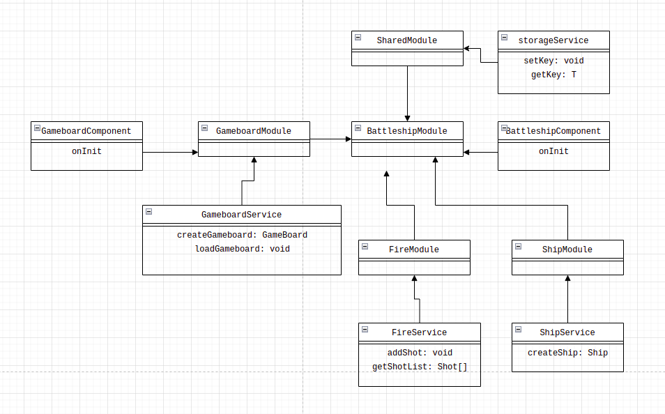

# DOCUMENTO DISEÑO
El proposito de este documento es mostrar el diseño que se implementa para el desarrollo de la aplicacion.

# INDICE
- [Modulos del software](#modulos-del-software)
- [Librerias de terceros](#librerias-de-terceros)
- [Diseño arquitectonico](#diseño-arquitectonico)
- [Diseño de datos](#diseño-de-datos)
- [Diseño de interfaz](#diseño-de-interfaz)

# MODULOS DEL SOFTWARE
- AppModule: modulo principal en cual se genera con el boilerplate de Angular.
- AppRouterModule: modulo que controla la carga de modulos de entrada.
- BattleshipModule: modulo que orquesta los modulos necesarios para el correcto funcionamiento del juego.
- GameboardModule: modulo que controla y renderiza las celdas del tablero.
- ShipModule: modulo que se encarga de crear los barcos.
- FireModule: modulo que mantiene informacion sobre los tiros del juego.
- ConfigModule: modulo que mantiene la informacion parametrizable del juego.
- RecordModule: modulo que muestra informacion sobre las partidas realizadas.

# LIBRERIAS DE TERCEROS
- Angular
- Karma
- Tailwindcss

# NOTACION
- Camel case: para variables, atributos y metodos.
- Pascal case: para clases.
- Snake case: para constantes.

# NOMENCLATURA
Estandares para los nombres de conceptos (clases) en angular:
- modulo: NameModule
- componente: NameComponent
- servicio: NameService

# DISEÑO ARQUITECTONICO
En construccion...

# DISEÑO DE DATOS

    

    Fig.1 - Diagrama de los modulos Angular

    

    Fig.2 - Diagrama del modulo Battleship

    

    Fig.3 - Diagrama de los modelos

# DISEÑO DE INTERFAZ
En construccion...