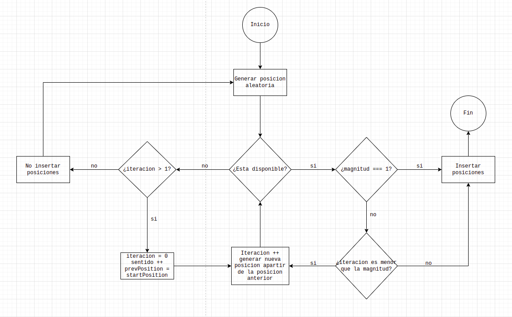

# MODELO SOLUCION
En este documento se especifica el modelo que se implementa para resolver los requerimientos.

# INSERTAR BARCOS ALEATORIAMENTE EN EL GAMEBOARD

    

    Fig.1 - Insertar barcos aleatoriamente 

